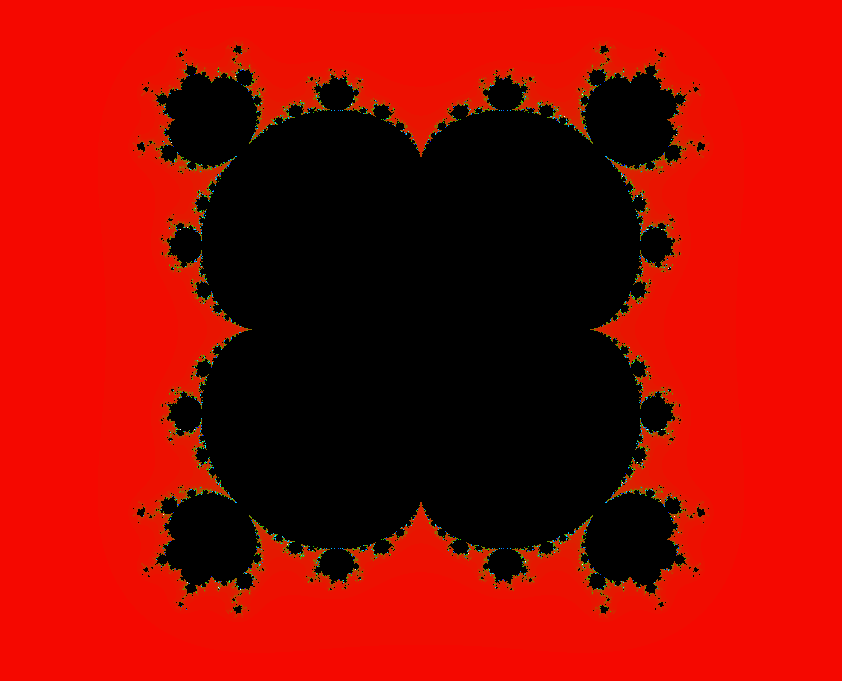

# OpenGL Mandelbrot Set

Normally the Mandelbrot set is defined as all complex numbers such that the recursive 
sequence `z(n)`, defined by `z(0) = 0` and `z(n + 1) = z(n) * z(n) + c` and `c` is in
the mandelbrot set if all values defined by `z(n)` have magnitude less than 2. This
modification attempts to redefine `z(0)` to different values. It does change the
Mandelbrot set into some interesting shapes (screenshot of one such case attached below).

Use the arrow keys to change the fractal. Up and down change the imaginary part positively
and negatively respectively, and right and left change the real part positively and
negatively respectively as well.

## Screenshot

