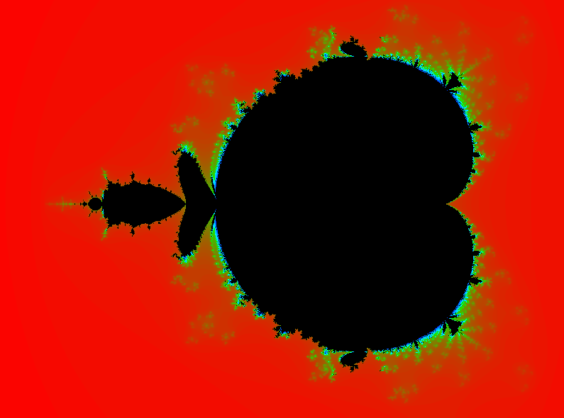

# OpenGL Mandelbrot Set

This was a small project that I made where I would draw the Mandelbrot Set using OpenGL.

change `#define N 5.0` to different values and see what it does.

## Screenshot

This is what N = 5 looks like:

